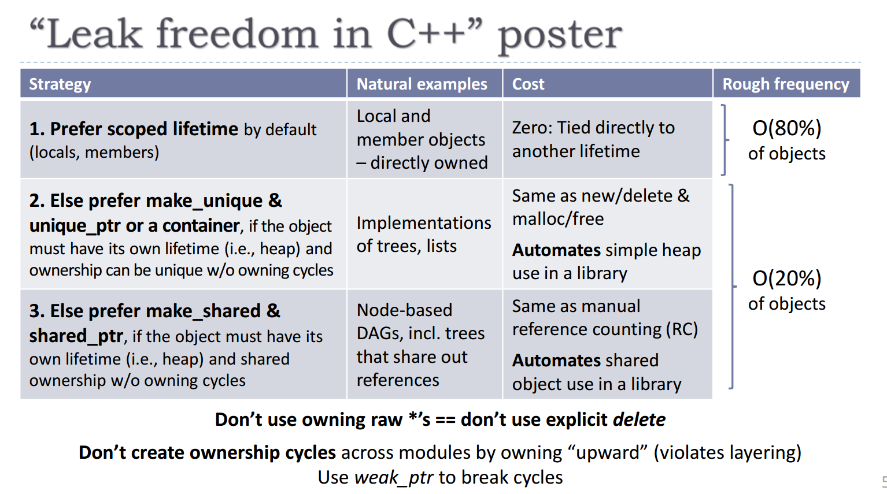

# week 1 (intro and types)
* <iostream> for cin, cout etc.
* <cstdio> or <stdio.h> for printf, scanf etc.
* compile with g++ using c++17 by: g++ -std=c++17
* streaming something to stdout (usually the terminal) actually stores it in a buffer which is at some point sent to terminal (flushed). std::endl prints a newline then flushes the buffer, it is equivalent to std::cout << "\n" << std::flush. Use \n for more control over when the buffer is flushed.
* default types are pretty standard (the least known one is probably enum - a single option from a finite constant set)
* implicit type conversions do happen in c++ e.g. bool b1 = 10 converts to true.
* declaration: I declare a name with a type!
* definition: I declare a name with a type and implementation!
* const: make everything const unless you know you need to modify it. If you are unsure, make it const and then remove it later if need be. const for containers make both the container and the container elements const.
* references: these are aliases (another name) for an object. They cannot reference null, nor can they be changed once set. You also do not dereference manually like you do with a pointer, it happens automatically. 
* const references mean you cannot update the pointed to object via the reference, even if the pointed to object is non-const.
* templated classes/functions are not real classes or functions. Real classes and functions are generated from them. vector<int> and vector<string> are two different types (unlike Java generics).
* auto: this keyword lets the compiler determine the type for you. It does strip off top level const and reference though.
* functions can have default arguments. Note that they are only able to be used for trailing parameters.
* pass by value copies the object into the argument, pass by reference doesn't copy the object but instead creates a reference (new alias) to directly reference the new thing. Technically, passing pointers is pass by value, it's just you're only copying a pointer. Use pass by reference when the argument is expensive to copy (large) or has no copy ctor (cannot even be copied)
* lvalue: a name that represents a memory location that holds a value. Can appear on both sides of an assignment. On the lhs it is having its value changed, on the rhs it is effectively being an rvalue (just a value) e.g. i = i + 1;
* rvalue: a value with no name. May only appear on the rhs of assignments
* call by value uses an rvalue only. This is why you cannot update the actual object inside the function (it is using a copy of it). Call by reference passes the lvalue (name/label) that references the actual object into the function, thus it is using the real object itself.
* function overloading: a function in the same scope that has the same name but different formal parameters is an overload. It must have different parameters otherwise it is a redefinition which is illegal. 
* overload resolution: find all functions in the current scope that have the given name, filter to only those that have the same number of parameters and are of the same or convertible type, then pick the one that needs least conversions or is a best fit. return type is not considered in resolution and doesn't effect whether a function is an overload or not.
* top level const (i.e. const on the actual thing itself, whether it is an object or pointer type) also has no effect on function declaration. This is because from the callers perspective, they are passing a copy into the function and so do not care whether the copy is modified or not. The decision of whether an rvalue parameter should be const or not only matters for the implementer of the function, but you can only implement one! e.g. you must choose between void foo(const int) and void foo(int), you cannot declare both.
* all objects can have top level const. top level const means the thing itself is const. a const int means the int is const. a const pointer means the pointer itself is const (cannot be repointed), but it says nothing about the object it points to.
* constexpr: a variable that can be calculated at compile time, or a function that may or may not be able to be calculated at compile time (thus decreasing runtime processing). better than using #define for constants.

# week 2 

## 2.1 - STL containers and iterators
* use <fstream> for io to/from files.
* std::ifstream my_input_file_stream {"file_name"} and std::fin for file input
* std::ofstream my_output_file_stream {"file_name"} and std::fout for file output
* remember to do my_io_file.close()
* prefer explicit casting with static_cast<to_type>(thing_to_be_casted) over implicit casts e.g. int num = static_cast<int>(7.33) is better than int num = 7.33
* iterate either by using a counting index (C style), iterator, or a foreach loop.
* a function template is a prescription to the compiler that tells it how to generate functions of different types. The template itself is not a function.
* STL (standard template library): a library of templated classes and functions. STL containers store data but don't know anything about algorithms. Iterators are an API that give access to container items in a specific way, irregardless of the underlying container. Each container implements its own iterator, then anyone is free to iterator over the iterms in the container using this iterator without having to know the internal of the container. Algorithms use iterators to implement their logic agnostic of container types. This is why STL algorithms use iterators!!! They are the glue between containers and algos.
* an iterator is an abstract pointer. They abstract containers to appear to be a sequence of objects, regardless of the underlying container structure. This sequence is most commonly accessed as container.begin() to container.end(). begin abstractly "points" to the first object in the sequence, and end abstractly "points" to a special end object that is 1 spot passed the last container object. use * to dereference an iterator (get the object it points to) and use iter++ to increment it to point to the next object in the sequence.
* note that container.end() isnt the last element, it is one passed the last element. It is a valid iterator value, but it is not valid to dereference it. 
* you can use const iterators (the iterator itself isn't const because you need to ++ or -- it but the thing it points to is treated as const), and reverse iterators, but the default is a forwards iterator. 
* note that with a reverse iterator you still use ++ as backwards is the forwards direction of this iterator.
* there are input (read *iter and access iter-> only access), output (write only *p=x access), forward (iter++ only), bi-directional (iter++ and iter--), and random access iterators (iter += x, iter -= y, < > etc.)
* stack and queue are container adapters and do not have iterators. It doesn't really make sense to iterate them anyway.
* you can iterate file stream as well e.g. std::ifstream in {"data.in"}; std::istream_iterator<char> begin(in)
* map vs unordered_map (logn for ordered but key requires < be defined, constant for unordered but requires a hashable key)

## 2.2 - STL Algorithms
* int std::accumulate(begin, end, x). sum from begin to end, starting with a value of x
* if you want the product instead of the sum, just use std::accumulate(begin, end, x, std::multiplies<int>)
* you can also only sum half way by doing end = c.begin() + (size()/2)
* std::lower_bound(begin, end, x) binary searches for the first value >= x
* std::upper_bound(begin, end, x) binary searches for the first calue stricly < x
* std::transform(c1.begin, c1.end, std::back_inserter(c2), std::to_upper) calls to_upper on each of the elements of c1 from begin to end and inserts the result into c2. Note that you cannot pass c2.end instead of back_inserter
* std::back_inserter(cont) gives you an ouput iterator (write access only), that adds to the end of it
* lambda function: a function that can be defined inside other functions. Use std::function<int(int, bool)> for a function that returns int and takes an int and bool as arguments, or just use auto. e.g. auto lambda = (int a, int b) [] { return a > b; };
* [] is a capture that can be used to capture local variables by value [=] or by reference [&]. Note that when useing a capture default of = or &, only the variables you actually use in the lambda are captured. You can also capture specific ones by reference or by value and they will ignore the default if given e.g. [factor, &total] captures factor by value and total by reference, [&, factor] would capture total by reference if it is used but captures factor by value.
* std::for_each(begin, end, [] (int& value) {value++;}); for_each applies the passed function to each element that is iterated over. Lambda functions are especially useful here and for any other places you use higher order functions.
* if you capture by value, then the copy in the lambda function will not update when the one in the local scope does. Be especially careful that you are passing a reference to a container into a lambda if you want that lamba to be able to actually update the container.
* if you capture by reference, then the lambda function variable will receive updates when the original updates. Be careful that you the original hasn't gone out of scope! undefined behaviour!

# week 3 - OOP

## scope
* the scope of a variable is the part of the program where it is accessible
* scope starts at variable definition (you obviously can't use something before it is defined)
  * remember that declaration does not allocate any memory, definition does, hence definition is the actual point at which the declared thing exists
* scope usually ends at the next closing brace "}" (but it won't in some cases e.g. global variable, static variable)
* define variables as close to first use as possible (WOO! finally some sense! 1511 "all vars at top of file" style sucks ass)
* in c++ all variables are objects (even primitive types)
* object lifetime starts when the object comes into scope and it is constructed
* each object has 1 or more constructors (ctors) that say how to construct it
* object lifetime ends when it goes out of scope and is destructed (only 1 dtor)
* generally use () to call functions and {} to construct objects
* RAII: resource acquisition is initilisation i.e. you encapsulate resources inside objects (acquite them in the ctor) that way you can be sure to free or close them in the dtor of the owning object.

## Exception basics
* an exception is a recoverable but critical exception. Use try {} catch(std::exception e) {} and throw(someexception)
* add noexcept to your function to tell the compiler to not generate recovery code for this function. If it does throw an exception, your program will crash. Use this to indicate to callers that they need not put your function in a try catch block because it wont throw exceptions.

## OOP basics
* interface: what is provided to the user (API)
* implementation: the attributes and methods that are used to implement the interface
* abstraction: separation of interface and implementation
* encapsulation: hiding of implementation (to allow for abstraction). Basically, the user doesn't need to know anything about the implementation (it can be hidden from them), such that different implementations can be used for the same interface.
* header files are the interface (but in c++ they can now have some implementation for classes which is a little weird - e.g. inline implementation of member functions). This is why public and private keywords etc. exist. They are a hack to show which things in the header file are implementation and which ones are interface. Public stuff is interface, so put it up the top of the header file/class. This is what users will read (and it is all they should need to read to be able to use your class).
* encapsulation means that an objecst state can only be accessed or modified through the public interface (API). This protects the state from user error and also makes the class easier to use (user need not concern themselves with implementation details, which can become quite complex, they just call functions with easy to understand names and documentation). This also allows for different implementations to be subbed in underneath the same interface, or for you to make changes to a an implementation without the user knowing).

## Classes
* there is no difference between class and struct in c++ other than classes are private by default and structs are public by default. In reality, use a struct when you want a multi-field data type that has little or no methods. Use a class otherwise. Note that you may well want to use a std::pair or std::tuple instead of a struct if you are only storing data.
* member functions may be defined const (trailing const) which indicates they don't modify the data members of the class. Note that it can still modify non-const paramters. It can also modify member variables that are defined with the mutable keyword e.g. mutable int y.
* mutable should be used very carefully. It indicates that this piece of data is not really a part of the classes state. For example, it could be a cache.
* friend functions and friend classes: non-members that may access private parts of the class. In general this is a bad idea but sometimes it is needed e.g. non-member operator overloads, related/manager classes e.g. iterators (although nested classes are usually better for iterators)
* anything declared inside a class needs to be accessed via classname::
* all classes have an implicit member called this. It is a pointer to the instance of the class. it has top level const (it cannot point to anything else)
* a ctor is generated if you do not supply one. Note that it can only be generated if one or more of the class members are missing both a in-class initialiser statement or a default ctor themselves.
* the initialisation phase runs before the ctor runs. in this phase the initialiser list is ran. Note that the initaliser list order doesn't matter, it's the order that the members are decalred in the class that matters.
~~~~
class C {
    // _b is initialised last even though it is first in the init list, because it is declared last in the class
    C(int x, int y, int z, bool b): _b{b}, _x{x}, _y{y}, _z{z} {
        cout << _z << endl; // prints whatever was passed as z because _z is set to it by now (init list has ran)
        _x = 100; // regardless of what was passed in, _x will be 100 because this runs after the init list does
    }
    
    int _x, _y, _z;
    bool _b;
}
~~~~
* static class members are associated with the class itself, and not any specific instance of it. They have global lifetime (program start to finish)
* classes should either provide definitions for copy construction and copy assignment, or they should use default or deleted implementations
~~~~
class T {
    T(const T&) = default; // copy ctor with default (compiler generated) implementation
    
}
~~~~
* 

* incomplete types can only be used to define pointer and reference types. This is because the type is incomplete and thus its size is not known, but a pointer/reference is always the same size so can still use those.
* The above rule implicity means that classes cannot have members of their own type e.g. struct Node { int data; struct Node next;} is illegal, but struct Node* next would be fine.

## l-values and r-values
* read more here and add to this: https://stackoverflow.com/questions/3413470/what-is-stdmove-and-when-should-it-be-used
* r-value : in simple terms, an r-value is a piece of un-named memory.
* l-value : a named piece of memory e.g. when you do vector<int> arr {1,2,3}; arr is really just a label that identifies a memory address. 
* reference : a reference is just a new name for an existing piece of memory.  
* l-value reference : a reference (new name) to an l-value (piece of already named memory). Denoted by T&
* r-value reference : a reference (new name) to an r-value (piece of un-named memory). Denoted by T&&  

**differences in passing**  
* pass by copy : argument object remains un-modified on the calling side because it is a copy that is passed to the function. This is sometimes the desired outcome but can be slow for large types. The called function can obviously do what it likes with its copy. TLDR: un-modified original, possibly slow copy, called function can do what it likes with copy
* pass by l-value reference : the called function operates on the actual argument object via its own new name for that object. Const-ness can be used to enforce immutability of the object if needed. It is slower to pass a reference than to copy for primitive types but much faster to call by reference for large types (no copying done, only overhead is making a new reference/name). TLDR: un-modified or modified original depending on const-ness, same overhead regardless of type, called function can do what it likes with object with respect to const-ness of the reference.
* pass by r-value reference :
  * thus it is clear that the point of r-value references is to get copy behaviour without having to make a copy (you can think of this as object recycling, we repurpose an existing object that we know is no longer needed instead of making a new one)
* if you pass an argument to a reference type parameter foo (whether l-value or r-value reference), the object will not be copied as that is the whole point of references (instead access already existing piece of memory through the new name, foo).
* the first two points reveal why we use r-value references (T&&) for accessing r-values. To explain, your r-value is just a piece of un-named memory, and so you pass it to an r-value reference e.g. T&& foo, to bind foo as a new name to that piece of memory. This makes it an l-value from the perspective of the scope who did the binding of foo to the piece of un-named memory (the r-value) i.e. a T&& parameter is an l-value inside that function
  * but why not use a l-value reference (T& bar) to add the new name bar to the piece of memory? hmm
* If you are passing an 
* if you want to pass an argument to a r-value reference parameter (T&&) then that argument must either already be an r-value or you must explicitly cast it to an r-value with std::move().
* std::move : this can be thought of as removing the names from an l-value piece of memory to make it into an r-value. See this page (https://stackoverflow.com/questions/3413470/what-is-stdmove-and-when-should-it-be-used#:~:text=It's%20a%20new%20C%2B%2B%20way,not%20copying%20all%20the%20data.) for a high level overview of what is happening, and see this page (https://stackoverflow.com/questions/7510182/how-does-stdmove-transfer-values-into-rvalues) and this page (https://stackoverflow.com/questions/12193143/whats-the-magic-of-stdmove) for the low level details.

# week 4

## friend? (read and add https://www.quora.com/What-are-the-differences-between-a-member-operator-function-and-a-friend-operator-function)
* how do you know whether to make a function a member function or just a friend function?
  * use members when the operation is called in the context of a particular instance
  * use friends when the operation is called without any particular instance (even if they don't require access to private details i.e. they can get all they need though public access) TODO: why make them friends if they don't have to be? isn't this bad encapsulation?

# Week 5 - Smart Pointers

## Ownership
* **ownership** : you can think of ownership as a responsibility for correct cleanup of a resource. You own it, you perform the correct clean up procedure for the current situation.
  * the term clean-up changes depending on context : delete for new, close for open etc.
  * just because you own something doesn't mean you will actually clean it up (sometimes it does, single ownership), it just means you are responsible for the cleanup IF it needs to be done (sometimes only a ref count needs to be updated, shared ownership)
* **single/unique ownership** : the resource is owned by a single object. Once this owning object no longer exists then the resource is released.
* **shared ownership** : the resource is shared between many objects and is only released once all objects no longer exist. This requires reference counts and is important to prevent a double/multiple free on the same pointer (which causes undefined behaviour). This is useful if you have a very expensive to copy resource.
* it is easy to picture the difference of unique/single ownership and shared ownership as just 1 pointer pointing to something (unqiue/single) vs many pointers pointing to something (shared). 

## Object lifetimes
* we attach the lifetime of an object to something else to create safe object lifetimes i.e. to ensure that an object will be destroyed once it is no longer needed
* remember that everything is an object in c++, and there are two main types;
* **1. named objects** 
  * all named objects are cleaned up automatically when their name goes out of scope. Scope is dependent on where they are defined.
  * **stack objects** : names/variables are tied to their scope - that is, they are automatically "freed" (popped off the stack) when they go out of scope
  * **data members** : members of classes/structs etc. are tied to the lifetime of that class instance (unless static). When the class is cleaned up, so are they. They class itself may be on the stack or the heap.
* **2. un-named objects (heap objects)**
  * by un-named we mean they don't have a label for their location in memory, they just have a reference pointing to them. For example, int* num_ptr = new int(). num_ptr is a name, but it is the name for the pointer (8 byte word that holds the memory address of the heap int as its value), and not the name for the actual heap ints memory. Thus when num_ptr goes out of scope and is popped off the stack (automatically cleaned up), the underlying int (4 byte word) at the heap remains. Since we no longer have the pointer, we cannot even call delete on the heap int anymore because we don't know where it is (its address).
  * For this reason, heap objects should be tied to their owner, that is, when the owner is cleaned up, so is the heap object itself. This is the motivation behind smart pointers, which are covered in the next section.
    * an owning raw pointer (raw pointer that points to the heap data) is tied to its scope/owning class instance, but the difference is that when it is destroyed (goes out of scope or owning class instance is destructed), the data that it points to is not cleaned up. 
    * a c-style array is exactly the same as the above (array variable is just a pointer) except that you don't clean up not only 1 element, but n.
  * remember that using the heap for an object is essentially saying "this object needs its own space AND its OWN LIFETIME"
* **named vs un-named objects, which one is better?** : we tend to want to **favour named/stack objects** because that memory is managed for us (the combination of the stack frame protocol popping things, and c++ calling objects destructors when they are popped from the stack allows for easy cleanup). If we wrap heap objects inside named/stack objects (e.g. int* data_ptr as a member of the class, call data_ptr = new int(arg) in the ctor, and delete data_ptr in the dtor), then we get automatic cleanup for unnamed heap objects too!! This is what smart pointers are, which are discussed in the following section.

## Smart Pointers (i.e. favouring named/stack objects over un-named heap objects)
* the rationale is that you can choose between;
  * **1. raw pointers** that point to "new" memory on the heap which is not freed unless "delete" is explicitly called. The heap memory is not freed when the raw pointer is popped from the stack frame.
    * yes a raw pointer is technically a named/stack object too, but it isn't owning and so doesn't hold-up the clean-up contract that owning demands
  * **2. smart pointers** (classes, and therefore named/stack objects) that abstract away the new into their constructor and the delete into their destructor. Hence when the smart pointer class instance is popped from the stack frame, the destructor runs which has been implemented to free the allocated heap memory! Clearly this is better.
~~~
// .h/.tpp file
template <typename T>
class SmartPointer {
  public:
    SmartPointer(T* value)
    ~SmartPointer() noexcept;
    T* get_value();
  private:
    T* data;
};

// .cpp file
SmartPointer::SmartPointer(T* value): data{value} {}
T* SmartPointer::get_value() { return data; }
SmartPointer::~SmartPointer() noexcept { delete data; }

// usage file
int main() {
    auto spi = SmartPointer<int>{new int{5}};
    int five = *(spi.get_value()); // it would be better to implement -> and * operator for the smart pointer class
}
~~~
* **types of smart pointers**
  * luckily, cpp implementes smart pointers for us, and so we don't need to code the above class ourselves. The different types of smart pointers available are;
  **1. std::unique_ptr\<T\>** : owns the underlying heap object. When the unique pointer object is destructed, so is the underlying heap object. It has no copy ctor or copy assignment. Prefer using auto and make_unique\<type\>(value) from the memory header when using unique pointers. This is safer than using new or passing in a pre-existing raw pointer (someone might "delete raw_ptr").
  ~~~
  std::unique_ptr<int> up1 {new int};
  std::unique_ptr<int> up2 {up1.release()}; // cannot copy construct or copy assign, but can transfer ownership from up to up
  auto up3 = std::move(up2); // transfer ownership by moving up2 into up3. Note that up2 is valid, but now points to null
  std::cout << *up3 << "\n"; // you can dereference smart pointers as if they are raw pointers
  // if the up points to a multi-field value then you can access it
  auto up4 = std::make_unique<Node>(10, 5, 15); // where Node has parent, left, right fields
  std::cout << up4->parent << up4->left << up4->right << std::endl;
  std::cout << up4.get() << std::endl; // up.get() returns the value of the underlying raw pointer i.e. the heap address
  ~~~
  **2. std::shared_pointer** : this is a smart pointer that uses reference counting. If n smart pointers all point to the same underlying heap object, then all n have to destruct before n will be freed i.e. when a shared_ptr destructs, the reference count is decremented, if the reference count is 0, then the underlying object is destroyed as well.
  ~~~
  Node* node = new Node(2,1,3);
  auto sp1 = make_shared<Node>(node); // sp1.use_count() returns 1
  auto sp2 = make_shared<Node>(node); // sp[1/2].use_count() returns 2
  sp2.reset(); // sp1.use_count is 1
  sp1.reset(); // use count is 0, now the underlying heap object is freed
  ~~~
  **3. weak pointer** : same as a weak pointer but it doesn't contribute to the reference count. This means the underlying heap object could be deleted out from under a weak pointer. Weak pointer has two methods that allow you to get around this. wp.expired() returns true if the reference count of the underlying heap object is 0 (and thus has been freed), and wp.lock performs "expired() ? shared_ptr\<T\>() : shared_ptr\<T\>(\*this)" i.e. it returns a shared ptr to the heap object if it hasn't been freed yet.
  ~~~
  auto sp1 = std::make_shared<int>(1);
  auto sp2 = sp1;
  std::weak_pointer<int> wp = sp1;
  sp1.reset();
  // wp and sp2 are still valid here
  std::cout << wp.expired() << std::endl; // prints false
  sp1 = wp.lock();
  // sp1 is recovered
  sp1.reset();
  sp2.reset();
  // underlying heap object destroyed
  sp2 = wp.lock(); // return shared_ptr<int>{} i.e. sp to null
  std::cout << wp.expired() << std::endl; // prints true
  ~~~
  **4. std::experimental::observer_ptr\<T\>** : basically a wrapper around a raw pointer. It has some benefits over a raw pointer, such as needing an explicit cast to cast it to a void ptr, you can't call delete on it, and it can't be incremented (sometimes you need to though). There are still cases where you should just use a raw pointer though e.g. if you need to increment it. This will remain in the experimental namespace forever according to Bjarne Stroustroup himself: http://www.open-std.org/jtc1/sc22/wg21/docs/papers/2019/p1408r0.pdf
* **common combinations**  
  1. unique ptr + raw ptrs (observers)
  2. shared ptr + weak ptr/raw ptrs (observers)
  * Note: use shared pointers when you need multiple pointers to a resource AND MORE IMPORTANTLY you don't know which one will live the longest (if you know which one will live the longest, you just make it a unique ptr and the rest observers/raw ptrs). You will always always just use unique_ptrs
**why we avoid using new and delete** 
* **concise code** : "unique_ptr\<LongTypeName\> up{new LongTypeName(args)}" must mention LongTypeName twice, while "auto up = make_unique\<LongTypeName\>(args)" mentions it once - this is one very small benefit for using make_unique etc. instead of new
* **argument leakage** : compilers evaluate function arguments in different orders, some left to right, others right to left. Therefore if you call a function **foo(new int, new double) then if one of these succeeds but the second one fails, the first one will be leaked** (not free'd). You can fix this with smart pointers, foo(std::make_unique\<int\>(), std::make_unique\<double\>())
* **encapsulates the raw pointer** : int* i = new int; std::unique_ptr\<int\> up1{i}, std::unique_ptr\<int\> up2{i}, ... , std::unique_ptr\<int\> upN{i}. As you can see, **if you use new and have a raw pointer then you can have it owned by many unique pointers** which doesn't make sense and will cause a crash on the second attempt to free (smart pointers aren't smart enought to get around this). By using auto up = std::make_unique\<T\>(val), you encapsulate the allocation within the make_unique function and so the only way to copy it would be to copy construct or copy assign it (and smart pointers ARE smart enough to defend against this because they have no copy ctor or assignment). It also prevents someone from calling delete on the raw pointer.
* **exception/stack unwinding safety** : technically std::unique_ptr\<X\>(new X) encapsulates the allocation as well (meaning the resource could not be re-used in any other way except for copy construction/copy assignment as well) but new isn't as exception safe as make_unique is.
**When you should/have to use new/raw pointers**
* Don't make unique pointers to foreign raw_pointers. You don't know if someone is going to call delete on that pointer or not!
**release vs reset**
* release -> ptr_to_res : releases ownership and returns pointer to resource (reLease, L for leakable).
* reset(ptr_to_new_resource) -> void : deletes the currently owned resource (and sets it to the newly passed in resource)
* **Pointer Ownership**  
* determining whether a pointer (of any kind) has ownership, and whether that ownership is shared, is easy as long as you understand what ownership is (to have ownership over a resource means to have the responsibility to clean it up when required)  
  **1. unique ptr - owning, non-sharing** : has ownership because it is responsible for freeing the un-named data. As the name suggests, this ownership is not shared  
  **2. shared ptr - owning, sharing** : has ownership because it is responsible for **possibly** having to free the un-named data. As the name suggests, this ownership can be shared and uses reference counts to do so. It is always reponsible for updating a reference count.  
  **3. weak ptr - non-owning, non-sharing** : a shared pointer that does not increment the reference count. Because it doesn't increment the reference count, it has no responsibility to free but it also has no power to keep the resource around if the reference count becomes 0 (i.e. all shared pointers release it). This is why you must check before accessing via a weak pointer, it may have been deleted from underneath you because you don't own it. There is also obviously no shared-ownership between weak pointers of the same resource, because there isn't even any ownership.  
  **4. raw c ptr/observer ptr - non-owning, non-sharing** : no ownership (reason stated many times), and hence non-sharing also. This is basically a weak pointer that doesn't have the ability to check whether the underlying data has been freed.  
  

# Week 5.2 - Exceptions

## Exceptions
* **what are they?** : exceptions are classes (objects) (std::exception is the parent class of all exceptions)
  * **why classes?** : The reason we have exceptions as classes is it provides a generic and consistent interface to handle exceptions thrown by the standard library. All the exceptions generated by the standard library are inherited from std::exception. This also allows you to make your own sub-class of std::exception (or one of its derivatives) for making custom exception handlers. This exception interface means you can catch very specific exceptions if you like (e.g. std::bad_alloc), or any exception (std::exception). std::exception::what() is a method that returns a string that tells you what went wrong.

* **what do they do?** : they allow us to recover from critical but recoverable errors, instead of just terminating the program
* **how do you use them** : the throw keyword is used to throw an exception. You can use the try {} catch() {} block to catch an exception and handle it. You can catch multiple types of exception via polymorphism, and/or use multiple catch statements to catch multiple different and specific exceptions. The catch(...) is a special case known as the catch all. It will catch anything that is thrown.
~~~
std::cout << "Enter -1 to quit\n";
std::vector<int> items{97, 84, 72, 65};
std::cout << "Enter an index: ";
for (int print_index; std::cin >> print_index; ) {
    if (print_index == -1) break;
    try {
        std::cout << items.at(print_index) << '\n';
        items.resize(items.size() + 10);
    } catch (const std::out_of_range& e) { // catch a specific exception
        std::cout << "Index out of bounds\n";
    } catch (std::exception& e) { // catch any standard exception
        std::cout << "Caught some other standard exception: " << e.what() << std::endl;
    } catch (...) { // catch all (even if someone does throw int, throw string etc. this will work)
        std::cout << "CATCH ALL!\n";
    }
    std::cout << "Enter an index: ";
}
~~~
* **throw by value** : throw by value, not by pointer i.e. throw Exception() NOT throw new Exception(). It is rude to make the person catching your exception also clean it up from the heap i.e. they would have to call delete on it.
* **catch by const reference** i.e. catch(const ExceptionType& e)
  * why const? : because there is no reason to change an exception object that is caught
  * why reference? : avoids copy so it is faster BUT MORE IMPORTANTLY it **prevents slicing** (say you throw a sub-class but you catch statement has a parent-class, then because you don't have a reference you are passing by value and hence it will do a copy. Because the type you specified to create was the parent class, it is going to use its copy constructor and this will obviously throw away any extra parts the sub-class had i.e. slices them off). If you use a reference then it doesn't matter if your reference is of the parent class type because, even though it will use the parent's API, it will use the actual instance of the child that was thrown.
* **rethrow** : the first catch block that can catch the exception (argument matches thrown type) catches the exception. By default, the other catch blocks do not also catch it. You can rethrow the exception by calling throw; again, however.
* **stack unwinding** : this is the process of exiting stack frames until an exception handler is found when an exception is thrown. If one is never found, the program terminates. 
  * stack unwinding obviously calls destructors of all objects on the call stack, but any object that is not itself named (on the call stack) or owned by a named object will not be cleaned up i.e. raw pointer to heap memory -> the raw pointer itself will be cleaned up because it is on the stack frame, but the heap memory it pointed to is leaked.
  * if another exception is thrown during stack unwinding, the program terminates. However, it is okay for a destructor of a stack object to throw an exception as long as it handles it itself (doesn't leave the dtor). In general, dtors are noexcept anyway, because they need to release resources it doesn't make sense to allow them to fail (this is allowing leaks).
  * remember RAII : resource acquisition is initialisation -> encapsulate resources inside objects by acquiring the resource in the ctor and releasing it in the dtor. A good example of this is smart pointers.
* **partial construction** : the c++ standard states that "an object that is partially constructed will have destructors executed for all of its FULLY constructed members". The destructor will not be run for any objects who didn't fully construct. A destructor will not be run for an object that is partially constructed. The exception to the rule is an exception thrown in a ctor that delegates. See this post for more detail (https://stackoverflow.com/questions/32323406/what-happens-if-a-constructor-throws-an-exception/32323458) as well as the example below;
~~~
// this is an int that throws an exception if you try pass 69 to it
class BadInt {
  public:
    MyInt(int i) : _i{i} {
      if (i == 69) throw std::exception{};
    }
  private:
    int _i;
};

// if we do Leaky(420, 69) then we will leak the int on the heap that contains 420
// this is because BadInt(69) will throw, hence the dtor for Leaky will never run
class Leaky {
  public:
    Leaky(int a, int b):
      _a{new BadInt{a}}, _b{new BadInt{b}} {}
    ~Leaky() { 
      delete _a;
      delete _b;
    }
  private:
    BadInt* _a;
    BadInt* _b;
};

// this still throws an exception, the difference now is that we don't leak
// anything because _a is a fully constructed subobject and so its dtor will run
class Plugged {
public:
    Plugged(int a, int b):
      _a{std::make_unique<BadInt>(a)}, 
      _b{std::make_unique<BadInt>(b)} {}

  private:
    std::unique_ptr<BadInt> _a;
    std::unique_ptr<BadInt> _b;
};
};
~~~
  
## Exception Safety Levels
**1. no throw** (failure transparency - callers are unaware of whether the function throws or not) : this is achieved using the "noexcept" specifier. This means the method can throw exceptions but it must handle all of them inside itself i.e. no-throw means that if the method throws an exception and doesn't handle it itself then it will crash the program. Usually used for things like closing files, freeing memory, ctors, dtors etc.
**2. strong exception safety (commit or roll-back)** (i.e. either all changes are done successfully and the resultant state is commited, or we roll-back to the original state) : if the function throws then everything will be as it was before the call was made
  * used in copy ctors and copy assignment, copy and swap idiom (https://stackoverflow.com/questions/3279543/what-is-the-copy-and-swap-idiom)
  * achieved by first performing any operations that may throw but don't do anything irreversible, then performing irreversible operations that don't throw
**3. basic exception safety** : When the function fails (throws exception), there can be side-effects but all invariants will still be true and we have a no-leak guarantee. We are left in a "valid but unspecified state" with the guarantee that no resources have been leaked. i.e. any stored data will contain valid values, even though these may be different from what was stored before
  * move ctors that are not noexcept behave in this way e.g. when you move a unique_ptr it is left in a valid state (but the underlying pointer is set to null). In general, when you move any object, it must remain valid (can be destructed like any other object), it's just that its values are unspecified now (the implementation of its move may have nulled them out, set them to garbage, or just left them as they were). 
**4. no safety**
* There are no guarantees. Strap in boys.
* **which one to use?** : generally the preference is from 1 to 4. No-throw and strong exception safety are the best but it's not a strict hierarchy i.e. no-throw isn't always better than strong etc etc. because it's not always appropriate to use each type e.g. it doesn't really make sense for an at() method to be no-throw/noexcept because if a user accesses an out of bounds index they should be notified (we throw an out of bounds exception and want our array to remain unchanged so we use strong exception safety here), instead of this error being silently handled within the at() function (which would be the "no throw" way of doing it)).

# week 6 - templates

## Polymorphism in C++
* Polymorphism is when you have the same single interface I (API) being implemented differently (say version A vs version B etc.). You use that same interface (I) regardless of whether you have an A or B, but what actual implementation gets called depends on whether you have an A or B.
* C++ has two types of polymorphism, static and dynamic
* **static polymorphism** : as the name suggests, this is compile-time polymorphism. This involves both function overloading (multiple function prototypes with the same name but different parameters) and templates (implementation of function logic without specifying actual types)
* **dynamic polymorphism** : as the name suggests, this is run-time polymorphism (BUT it can also be compile-time depending on the variable type). See the week 8 section.

## Generic Programming
* generic programming is programming where you write software components (methods, classes etc.) that are independant of types
  * it is the implementation of the logic i.e. the logic for a min algorithm doesn't change just because the data type being compared changes (the only thing that changes when the data type changes is how the comparison of the two variables of said data type are compared e.g. for an int you just see which one is lesser, for a string it is alphabetic, for a student class it could be comparing by zid etc.)
  * because the logic is the same regardless of data type, as long as the data type being passed in has correctly implemented the operations that the generic algorithm needs, then it will work (like above for min the data type must have operator< defined). This is the basic programming concept of contracts/promises coming up yet again i.e. the type has to implement the methods/operators that the generic algorithm needs.

## Why Templates?
* without templates, we cannot program generically - that is, we cannot create a function which accepts and applies the same logic to two very different data types. Instead, we must create two versions of the same function e.g.
~~~
int min(int a, int b) { return (a < b) ? a : b; }
double min(double a, double b) { return (a < b) ? a : b; }
~~~
* as explained above, the logic (the body of the function) is exactly the same for the two different functions. The only difference is the types. Hence the compiler should be able to just insert the type for us, and as long as we uphold the contract of implementing the methods/operators that the function needs, everything should work. This is the idea behind function templates.

## Function Templates
* first of all, function templates are NOT CODE, they are instructions to generate code
* secondly, the generation of a function (from a function template) for a particular type only happens when a call to the templated function is seen during compile time i.e. if you never parameterize a templated function then no actual functions will be generated (the compiler only generates what you parameterize)
* you can think of templates as making the compiler generate function overloads for you (as described above). The compiler has to compile each templated function n times - where n is the number of unique ways you parameterized that specific function template). * This also mean that run-time is faster because we have the instructions specific to each type ready to go (i.e. the different overloads are generated at compile time, not run-time)
  * this is an example of how C++ shifts more work to compile time to have a faster run time (same motivation as constexpr)
* you make a templated function by using the keyword template. Then you put however many **template type parameters** you need inside the **template parameter list**
~~~
template <typename T> // this is the template parameter list. T itself is a template type parameter
T min(T a, T b) {
 return a < b ? a : b;
}
~~~
* confusingly, template type parameters (i.e. T above) are called **type parameters**. **Non-type parameters** are any actual concrete types like int, string, char etc. (but they have no default value)
  * it's easier to think of these as "typename parameters" and "non-typename parameters" becuase you use the keyword typename when there is no concrete type and the concrete type otherwise. Basically, it's answering the question of whether they are GENERIC TEMPLATE types or not. T is a generic template type, int is not, it's a concrete type.
  * another way to remember it is that you pass concrete types (char, int, std::string etc.) to type parameters (T, G etc.), whilst you pass values (1, 3.0, 'a', "hello" etc.) to non-type parameters (int, double, char, string).
~~~
// T is a type parameter (because you pass a type to it)
// size and scaler are non-type parameters (because you pass values to them)
template<typename T, int size, double scaler>
foo(T lhs, T rhs) { ... } 
~~~
* non-type parameters are often used for passing things like container size e.g. "int array_size or int queue_size". The advantage of this is improved performance - the size of the container is determined at compile time requiring less to be done/processed at runtime. The disadvantages are 1. code explosion - instantiation created for a queue of every size and 2. you are unable to copy construct easily (for templated classes)  
~~~
// example of a non-type parameter being used to specify a container size
// this template allows us to generate find_min for std::arrays of any type (that has < implemented) of any size
template <typename T, int size>
T find_min(const std::array<T, size> arr) {
  T min = arr[0];
  for (const auto& item : arr) {
    if (item < min) min = item;
  }
  return min;
}

std::array<int, 3> x {3,1,2};
std::array<double, 4> y {3.3, 1.1, 2.2, 4.4};
print(find_min(x)); // 1
print(find_min(y)); // 1.1
~~~

## Class Templates
**Template Declarations and Definitions**
* when you declare a template component (function or class), you must write the template parameter list (i.e. template <...>) above the class name or function name (except for when a function declaration is made inside a templated class, then it doesn't require it)
  * you can think of it like scopes. If you write the template paramter list above the class, then everything inside the class knows what the template parameters are
  * but that doesn't mean a method defined outside the class knows about them, so you must add the template paramter list above the method
  * tldr: the compiler won't know what T means if you don't have the template paramter list including T in it for each scope it is used in
~~~
// mystack.h file

template <typename T> // add typename T to the scope of the class definition
class MyStack
{
 void Push(T&); // don't need to write template <typename T> above this, the whole class scope knows about T from above
 std::vector<T> _stack;
}

#include "mystack.tpp" // include the definitions after the declarations
~~~
* also, **when you define a templated class's member function otuside the class, not only do you have to add the template parameter list as described above, but you must parameterize the class name with the appropriate template parameter**
  * i'm not 100% sure why this is the case, but i'm guessing it's so you can have a non-templated class called MyStack if you want to? 
~~~
// mystack.tpp file (which is included in the .h file)

template <typename T> // need to add typename T to the scope of this definiton
void MyStack<T>::Push(T& element) { _stack.push_back(element); } // need to parameterize stack with T

template <typename T> // again, need to add typename T to each method definiton
void MyStack<T>::Pop() { _stack.pop_back(); } // same as above
~~~
**template class example: implementing the rule of 5 (6 imo) for a vector based stack**
~~~
// 1. ctor
template <typename T>
Stack<T>::Stack() {}

// 2. copy ctor
template <typename T>
Stack<T>::Stack(const Stack<T> &s) : stack_{s.stack_} {}

// 3. move ctor
template <typename T>
Stack<T>::Stack(Stack<T> &&s) : stack_(std::move(s.stack_)) {}

// 4. copy assignment
template <typename T>
Stack<T>& Stack<T>::operator=(const Stack<T> &s) {
  stack_ = s.stack_;
} 

// 5. move assignment
template <typename T>
Stack<T>& Stack<T>::operator=(Stack<T> &&s) {
  stack_ = std::move(s.stack_);
} 

// 6. dtor
template <typename T>
Stack<T>:: ̃Stack() { }
~~~
* **member functions are only generated if called** : Just like how a specific concrete version of template\<typename T\> T min(T a, T b) { return (a < b) ? a : b; } will only be generated if you make a call to it with that specific concrete type, a templated classes member functions will only be instantiated if they are actually called. e.g. if you never call MyStack.pop() from above, then it will never be generated
* **static and friend functions** : each concrete class that is generated from a class template has its own versions of any static variables, even if they weren't of a generic type. The same goes for friend functions.
* **default types** : you can pass default arguments to type parameters 
~~~
template <typename T, typename C = std::vector<T>>
class MyStack {
...
  C _stack; // this is a std::vector<T> unless something is explicitly passed for C
}
~~~

## defaulting functions and the rule of five (or 6?)/special member functions
* C++ has 6 special member functions: ctor, dtor, copy ctor, move ctor, copy assign, move assign (https://stackoverflow.com/questions/4172722/what-is-the-rule-of-three)

# Week 7 - Templates part 2

## Template include and compilation
* templates must be defined in the file that they are declared. This is because the definition needs to be known at compile time. If it were to happen at link time (when the .cpp files are linked), then a variation for every possible type would have to be generated (see here: https://stackoverflow.com/questions/6264249/how-does-the-compilation-linking-process-work). 
* Basically, the compiler will generate different concrete types when you do MyStack\<int\>, MyStack\<double\> and MyStack\<std::string\>. These concrete types all have different concrete implementations (same logic, but the types are different, which does lead to different assembly/machine code). The compiler needs access to the implementation templates so it can generate each one of these different implementations.
**Example: doesn't compile**
* The following code will not compile. When compiling user.cpp, the compiler says "min is declared but not defined, which is okay, the definition (implementation) will be supplied from some other object file that the linker will have". However, min.cpp cannot be compiled because it doesn't know what concrete types to generate (remember that compilation happens in isolation for the different cpp files, they go from cpp files to object files, which are then linked to become an executable or library (dll)).
~~~
// file min.h
template <typename T>
T min(T a, T b);

// file min.cpp
template<typename T>
T min(T a, T b) {
    return (a < b) ? a : b;
}

// file user.cpp
#include "min.h"
int main() {
    std::cout << min(1,2) << "\n";
}
~~~
* if you were to add;
~~~
template 
int min<int>(int,int);
template
double min<double>(double, double);
~~~
to the .cpp file then this would compile because now the compiler known which implementations to generate, then at link time the linker can patch the min calls in the user object file to reference the matching ones generated in the min object file. This is a bad idea however, because you have to manually type out all the different concrete instantiations you want (and forgetting one will cause it to not compile)
* **The correct inclusion compilation model** : template declarations go in a .h file. template definitons go in a .tpp file. **The .tpp file is then included in the .h file after the declarations.**
* This does slow down compilation as every single file that includes the .h will generate the concrete implementations, then later on the duplicate implementations have to be removed by the linker, but it does automate template type generation.

# Week 7.2 - Custom Iterators

## Normal iterators
**what are they?**
* abstract notion of a pointer. They abstract a container to be a sequence of objects starting at begin() and ending at end().
* they are the glue between containers (supply an iterator, don't know anything about algorithms) and algorithms (use an iterator, don't know anything about the container)
**invalidation**
* as iterators are abstracted pointers, if you modify a container such that it needs to be reallocated, then the iterators and any other references become stale (because the container has moved in memory).
* using an invalid iterator is undefined behaviour.
* **push_back** : if the new element cannot fit (capacity already used up), then push_back causes a reallocation (moves in memory), and hence all iterators and references are invalidated. If it can fit, only the end() iterator is invalidated.
* **erase** : this invalidates iterators/references at the point of erasure and onwards (we'll call this the "rest"). It returns a new iterator that can be used to traverse the possibly reallocated rest.
* in general, modifying pre-existing container values does not invalidate anything, but adding or deleting values does.

TODO: rest of custom iterators lecture

# Week 8 - Advanced Templates

TODO: rest of advanced template (assuming I wont need it for interview)

# Week 8.2 - Advanced Types

TODO: rest of advanced types (assuming I wont need it for interview)

# Week 9 - Runtime Polymorphism

